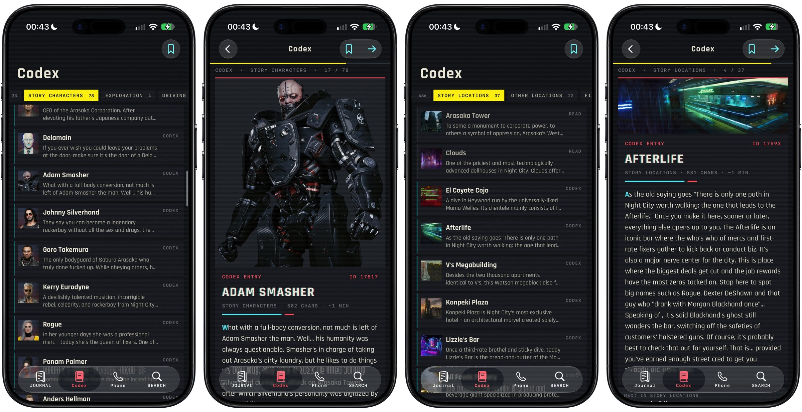

# Datashard

Offline reader for everything written in Cyberpunk 2077 — shards, net pages, codex, emails,
files, quests, tarot, phone threads and every spoken line, with the game's codex art, tarot
cards and contact avatars — in the game's pause-menu skin. Programmatic UIKit, built and deployed
with [xtool](https://github.com/xtool-org/xtool), no Xcode project.



Journal · Codex · Phone · Search, over a bundled SQLite export of
[cp2077-db](https://github.com/guitaripod/cp2077-db). The dataset is CD PROJEKT RED's text, so
it is generated from your own install and never committed:

```bash
cpdb build "/path/to/Cyberpunk 2077" cp2077.sqlite --images
cpdb cp2077.sqlite export Sources/Datashard/Resources/cp2077-reader.sqlite
xtool dev
```

On macOS, `brew install xtool` and run `xtool setup` once in Terminal; it asks for an Apple ID
and a verification code, so it cannot be done over SSH. Building the dataset needs Linux, but
the export it produces is just SQLite: copy one in and `xtool dev` is all a Mac needs.

GPL-3.0. Rajdhani © Indian Type Foundry, OFL 1.1.
